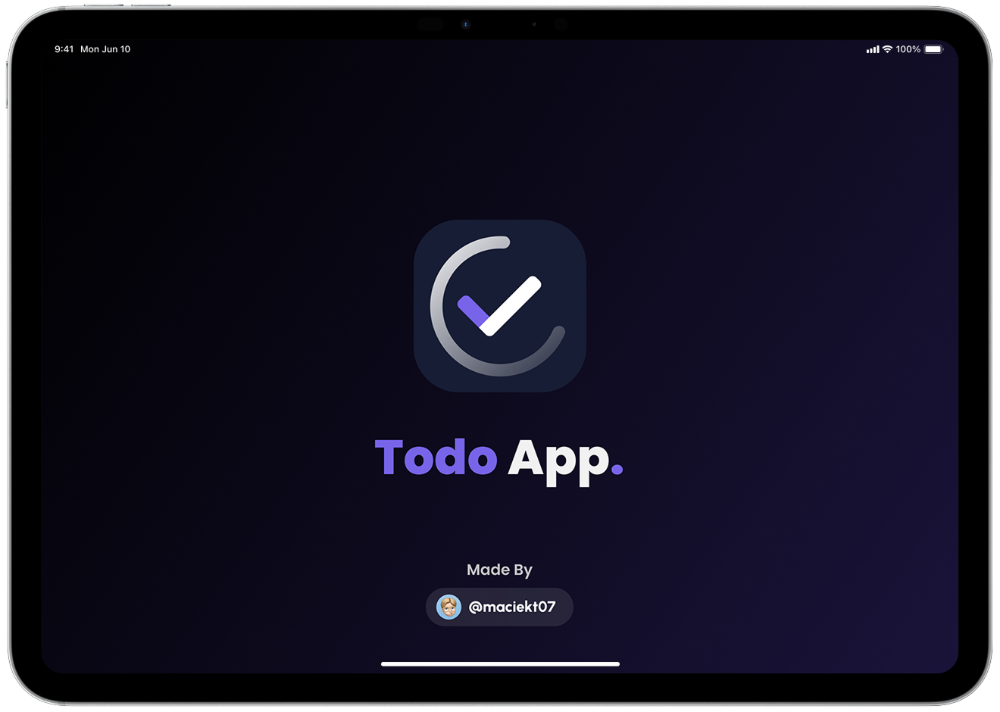

## 💻 Tech Stack

<ul style="display: flex; flex-direction: column; gap:10px;">
  <li style="vertical-align: middle;">
     React
  </li>
    <li style="vertical-align: middle;">
     Typescript
  </li>
    <li style="vertical-align: middle;">
     Vite
  </li>
  <li style="vertical-align: middle;">
     Vitest
  </li>
  <li style="vertical-align: middle;">
     Emotion
  </li>
    <li style="vertical-align: middle;">
     Material UI (MUI)
  </li>
</ul>

## ⚡ Features

### 🔗 Compartilhar Tarefas por Link ou QR Code

Compartilhe suas tarefas com outras pessoas facilmente usando um link ou QR code.

**[Exemplo de Link](https://react-cool-todo-app.netlify.app/share?task=N4IgJg9gdgpiBcAzAhgGwM4wDQgA4EspYwEAXAJwFdsQpkBbOeEAdRgCN19SYACAERgA3GKgi5GUUiBxgY6AMbl8uUvmgIQAYXIxkPXsl6pkUMIQDmvXMgt8A7twAWvAEp6FpAHQArdL0QIcl4FVHwYKS9eJ1JSXHR4AHpE+1SvAE8ISlJKdhgvBQh6FP0FJwB+IQBedgBZAGsoRABpAA0ASQAxAEEADgAyUiqAJgBmdH7kdgB9MtNYVCrEXRgtCDktBlwvIIsZEBh6CB98TQBGRABOMDOAWgvRxAVb4YAGV7B7xAAWdnZ9wpiciaADE7AAbMNvohEPswPomCA3sMAKy3V7fF6vAAqrzO8DOl3gr3BXleAHZRgAtOF6MBhWCaZFojEvUa4-FnXrE15k940nAKBEWILpBAAbVA+BIzFew0uwwU7GQaMQ4Jgw1u3zOCkx7BRyHJtwUKMuyFeyGQMAUiBgo32dEYmhYQXq+0Ox1OzAeGoBECBoKhvRgMJAAF8sFKZWdwb1yWdUdryd9waMyaMcI7EWtzFA9jgPSdzogDaqYK9YYL-UFQeCbsNQ2GALo4EzoUgAZWQIiZcpZmLeHPgb3go15oxR1PDQA&userName=Natanael%20Silva)**

### 🤖 Sugestões de Emoji com IA

Isso usa `window.ai`, um recurso experimental que funciona apenas na versão de desenvolvimento do Chrome com algumas configurações ativadas. [Mais informações](https://afficone.com/blog/window-ai-new-chrome-feature-api/)

Código: [src/components/EmojiPicker.tsx](https://github.com/maciekt07/TodoApp/blob/main/src/components/EmojiPicker.tsx#L116)

### 🎨 Temas de Cores & Modo Escuro

Escolha entre vários temas de cores e alterne entre os modos claro e escuro conforme suas preferências.

### 🗣️ Leitura das Tarefas em Voz Alta

Opção para ter as tarefas lidas em voz alta usando a API nativa `SpeechSynthesis`, com uma seleção de vozes à escolha.

### 📥 Importar/Exportar Tarefas

Os usuários podem importar e exportar tarefas para/desde arquivos JSON. Esse recurso permite fazer backup das tarefas ou transferi-las para outros dispositivos facilmente. [Exemplo de Arquivo de Importação](https://github.com/maciekt07/TodoApp/blob/main/example-import.json)

### 📴 Progressive Web App (PWA)

Este aplicativo é um Progressive Web App (PWA), o que significa que pode ser instalado no seu dispositivo, **utilizado mesmo quando estiver offline** e comportar-se como um aplicativo nativo com atalhos e ícones de aplicativos.

### 🔄 Prompt de Atualização

O aplicativo apresenta um prompt de atualização personalizado que notifica os usuários quando uma nova versão está disponível, permitindo uma atualização fácil para acessar as melhorias mais recentes.

### 📱 Telas de Inicialização Personalizadas

O aplicativo gera automaticamente telas de inicialização personalizadas para vários dispositivos iOS e iPadOS, tanto no modo claro quanto no modo escuro. Essas telas proporcionam uma experiência de lançamento suave e nativa quando o aplicativo é aberto como PWA.

Para gerar as telas de inicialização: `npm run generate-splash`

## 👨‍💻 Instalação

Para instalar e rodar o projeto localmente, siga os seguintes passos:

- Clone o repositório: `git clone https://github.com/maciekt07/TodoApp.git`
- Navegue até o diretório do projeto: `cd TodoApp`
- Instale as dependências: `npm install`
- Inicie o servidor de desenvolvimento: `npm run dev`

O aplicativo agora estará rodando em [http://localhost:5173/](http://localhost:5173/).

> [!DICA]
> Para testes em dispositivos móveis, use `npm run dev:host` para visualizar o aplicativo na sua rede local.

## 📷 Capturas de Tela

## 🚀 Performance

## Créditos

Feito com ❤️ por [Natanael Silva](https://github.com/NatanaelSilva), licenciado sob [MIT](https://github.com/maciekt07/TodoApp/blob/main/LICENSE).
